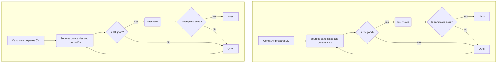

# Hiring quality

The goal of the recruitment process is to fulfill the company's requirements by obtaining new staff members. These newly hired employees should possess the skills, or be close to possessing them, needed to perform tasks that the existing team is unable to complete.

Each process should be efficient.

Efficiency in the recruitment process entails expending minimal time and effort to secure high-quality professionals.

The ideal recruitment process would involve no costs, as a skilled employee would miraculously emerge, meet the company's needs, and remain with the organization for as long as they are required, consistently contributing value to the team.

While ideal processes are unattainable, striving for optimal efficiency is essential. A recruitment process where a single _good candidate_ is found, successfully interviewed, and hired in a one day is significantly more efficient than a process where a week is required to find 20 candidates, interview all of them, and only hire one.

A _good candidate_ refers to a specialist who _meets the team's preferences and requirements_, and who remains an integral part of the team for an extended period.

Multiple factors contribute to employee retention and productivity; however, if an individual is not well-suited for the position and the team, it is very unlikely that they will remain with the company for an extended period or be highly productive.

This "satisfaction of desires" or "match for the job" is the **quality of hire**.

To recap, **hiring process should be efficient in providing quality hires**.

Every stage of the sourcing and selection process should minimize time and effort while still preserving the desired quality of hire.

## Hiring process

The typical recruitment process can be described by the following algorithm:

Each diamond symbolises a decision point where a choice to either "proceed" or "quit" is made.

Both the applicant and the organisation separately make decisions, taking into account their experiences during the process and the information they have gathered.

In the event that either the applicant or the organisation decides to terminate the process, the company must find a different candidate.

**The fewer iterations a recruitment process involves, the more efficient it becomes.**

A perfect recruitment process entails only a single iteration, in which the initially sourced candidate chooses to join the company, and the company likewise decides to hire that individual.

This signifies that decisions should be made optimally at every phase of the process by both parties. If either party makes an incorrect decision during a particular phase of the process and discovers this error later on, it leads to the unnecessary expenditure of time and resources.

For instance, if 10 applicants were chosen for interviews after evaluating their CVs, but none of them succeeded in the interview stage, it appears that the decision-making process during the resume review phase is severely flawed and requires revision.

Alternatively, if 10 candidates succeeded in the interview stage and were employed, but failed to complete the probation period, it indicates that the decision-making process during the interview phase is significantly flawed and requires revision.

**Whenever the outcomes of a decision are unsatisfactory, the decision-making process should be reevaluated and adjusted.**

The further along the hiring process a flawed decision-making occurs, the greater the cost of the resulting waste: having 10 individuals unable to complete their probation period is significantly more costly than having 10 individuals fail the interview stage, and even more so than having 10 individuals not chosen for interviews based on the evaluation of their CVs.

In this and subsequent articles, my focus will be on exploring the various stages of the hiring process using decision-making theory as a framework.

This article specifically addresses the initial phase: candidates deciding to apply for a position based on their analysis of the job description, and the company determining whether to advance the candidate to the interview stage based on their analysis of the candidate's CV.

In accordance with [Decision Theory](https://plato.stanford.edu/entries/decision-theory/), every decision should be made on the basis of _valuable information_.

_Valuable information_ adheres to the following criteria:

1. it is understood by the recipient
2. it is relevant — related to aspect of work and is actual
3. it is accurate
4. it is complete — contains all relevant data with no gaps
5. it is trustworthy — recipient should have confidence in the supplied information, trusting its relevance, accuracy, and completeness

### Company prepares job description

Company creates and post a job description on their "careers" webpage, job boards, or share it with a recruitment agency.

A job description captures the main important aspects of a position, providing sufficient information for candidates to determine whether they should submit an application.

To create an accurate job description, a thorough [job analysis](https://www.shrm.org/resourcesandtools/tools-and-samples/toolkits/pages/performingjobanalysis.aspx) is necessary. According to the book "[Job and Work Analysis: Methods, Research, and Applications for Human Resource Management](https://www.amazon.com/Job-Work-Analysis-Applications-Management-ebook/dp/B07PMTQL2Q/)", the most effective tool for job analysis involves observation or pair working, where the analyst works side by side with the individual or closely observes them, asking clarifying questions as needed.

Regrettably, this approach is infrequently implemented. Many job descriptions found on job boards and company websites tend to only enumerate the tools, languages and frameworks candidates should be familiar with, accompanied by generic information and buzzwords, rather than offering comprehensive details.

Moreover, the majority of companies aim to create appealing job descriptions by emphasizing the positive aspects they believe will entice candidates, while downplaying or omitting any facts or conditions they think might dissuade potential applicants.

### Candidates analysing JD and making a decision

On this step the candidate analyses JD and makes a decision whether to apply.

How good would the candidate decision possibly be if we review typical job description (prepared with no job analysis) for matching _valuable information_ requirements?

1. :heavy_plus_sign: understood by the recipient
2. :heavy_minus_sign: actual and relevant
3. :heavy_minus_sign: accurate
4. :heavy_minus_sign: complete
5. :heavy_minus_sign: trustworthy

Actuality, relevance and accuracy are usually quite low as the proper job analysis is almost never done and the companies focus on making the information appealing. Trustworthiness is usually quite low too: candidates know that the companies "are not telling the whole truth".

Completeness is not even achievable as the job activities and participating in teamwork can not be possibly reduced to the short text description.

Proper rational decision can hardly be made in this scenario, and in most cases candidates rely more on the public image of the company, it's HR brand. As a result, well-known companies often attract a substantial number of applicants for positions that may not be as appealing as other job opportunities available in less popular organisations.

### Candidates prepare their CVs

CVs serve as the conventional means for candidates to present themselves to potential employers. These documents are typically concise, featuring an overview of the job seeker's work experience, educational background, qualifications, and some personal details.

The underlying principle of a CV is akin to that of a job description: to supply sufficient information for the opposing party to make a sound decision.

Nonetheless, CVs appear to be more problematic, as they often contain considerable noise and bias in the information provided.

Typically, the following information is presented in CVs:

- Employment history, including years spent at each company and position
- Professional accomplishments
- Education, certifications, and training courses
- Personal information, such as hobbies and side projects

It is rare for candidates to intentionally provide false information regarding their previous workplaces, years of work, and held positions.

The situation is more challenging when it comes to work achievements. Individuals typically work within teams that possess emergent properties, such as ability to create value for clients through team members collaboration. It is impossible to objectively assess the individual contribution to the collective outcome. This is, incidentally, why [individual performance review practices make no sense](https://qase.io/blog/performance-reviews-and-quality/).

Since determining individual contributions is unattainable, claiming in a CV that a person was responsible for a specific percentage of a product's development is a statement fraught with _noise_ and _bias_.

Any activity an individual participated in may be overstated or downplayed irrationally, depending on their self-esteem and how they were evaluated within the company.

A noticeable erosion of trust exists in our industry, as individuals are aware that CV analysis is an essential step in the interaction with potential employers and that initial decisions are based on this examination. This awareness prompts candidates to intentionally modify the project experience and expertise they present in their CVs. [Research](https://pubsonline.informs.org/doi/10.1287/orsc.2023.1667) indicates that candidates often attempt to anticipate how recruiters will evaluate their resumes and modify the information accordingly, resulting in a reduction of decision-making process effectiveness.

Various agencies and individuals offer guidance to candidates on how to adjust the information in their CVs to enhance the likelihood of a positive decision.

Outsourcing and outstaffing firms often normalise the practice of modifying developers' CVs, tailoring them to appear more attractive to potential clients.

Many candidates are aware that CVs are frequently scanned automatically for keywords, and, as a result, they optimise the content not for accuracy and comprehensiveness, but for the inclusion of keywords they believe to be significant.

### Companies analysing CV and making a decision.

The company evaluates the applicant's CV and determines if they should advance the candidate to the interview stage.

To what extent can the company's decision be optimal, given the potential biases, inaccuracies, and embellishments on a candidate's CV, along with the varying perceptions and interpretations of the company representative reviewing the information?

Let's examine the information provided in the CV and assess its applicability in the decision-making process.

#### Personal information

The first section to evaluate is the individual's personal details.

1. :heavy_minus_sign: understood by the recipient
2. :heavy_minus_sign: actual and relevant
3. :heavy_plus_sign: accurate
4. :heavy_minus_sign: complete
5. :heavy_plus_sign: trustworthy

Candidates seldom provide false information (though occasionally they may alter their age to counteract ageism bias), and in the majority of instances, personal details can be deemed accurate and trustworthy.

Naturally, the applicant will not disclose comprehensive details regarding their personal matters.

The personal information's relevance to determining whether an individual is suitable for the job is virtually nonexistent.

When it comes to understanding, the situation becomes more challenging, as both aspects are prone to considerable bias.

The candidate's name is the first subject to bias, as [research](https://www.jstor.org/stable/3592802) has demonstrated that race or nationality may be deduced from it, triggering subconscious racial or national prejudices. Similar issues arise with gender and age. A [large-scale experiment](https://www.aeaweb.org/articles?id=10.1257/app.20140185) conducted by the French public employment service revealed a noticeable impact of bias during this stage.

The presence of a photo can also introduce bias in interpretation, as [studies have shown](https://www.hofstra.edu/pdf/orsp_shahani-denning_spring03.pdf) that attractive individuals tend to be favored over those deemed less attractive.

Information on hobbies can introduce further confirmation and [anchoring bias](https://www.simplypsychology.org/what-is-the-anchoring-bias.html) during the candidate selection process.

As Kahneman suggests, **cognitive biases are generally not mitigated by awareness of their existence**. Therefore, the only way to make a rational decision is to eliminate the entire personal information section from candidates' CVs.

I would contend that including a personal information section in a CV is not only unhelpful for decision-making but also undoubtedly **hinders the decision-making process**.

Numerous European companies have already [implemented anonymisation procedures](https://www.researchgate.net/publication/256044092_Anonymous_Job_Applications_in_Europe), removing all personal information from CVs to mitigate the negative impact on the decision-making process.

#### Education

1. :heavy_minus_sign: understood by the recipient
2. :heavy_minus_sign: actual and relevant
3. :heavy_plus_sign: accurate
4. :heavy_plus_sign: complete
5. :heavy_plus_sign: trustworthy

The information presented in the education portion of a CV can generally be considered accurate, complete, and trustworthy. It is unlikely that candidates would falsify information in this section, as their diplomas can be readily verified during subsequent stages of the recruitment process.

Nonetheless, the relevance of the information and how it is interpreted by the company representative can become contentious.

Many students complete their exams and graduate simply to obtain a diploma, making it difficult to ascertain whether a graduate possesses the necessary skills. Moreover, several studies ([1](https://www.researchgate.net/publication/299742997_Effectiveness_of_Academic_Performance_as_a_Predictor_of_Job_Performance), [2](https://www.academia.edu/34029574/Academic_Success_and_Job_Performance_of_Engineering_and_Scientific_Personnel), [3](https://www.jstor.org/stable/1804839)) indicate that fundamental skills have a moderate relationship with employees' contextual performance, while employees with stronger thinking and problem-solving abilities tend to experience greater benefits in exhibiting contextual behavior. Evaluating a candidate's problem-solving skills and thinking abilities cannot be determined solely by examining their diploma.

[Research](http://offers.indeed.com/rs/699-SXJ-715/images/InteractiveResearch_ExecutiveSummary.pdf) indicates a notable [ingroup favoritism bias](https://opentextbc.ca/socialpsychology/chapter/ingroup-favoritism-and-prejudice/) in interpreting education information: hiring managers who are college graduates tend to exhibit a strong unconscious bias towards candidates from similar institutions, while many managers without degrees often disregard the education details.

The general ambiguity of the information and prevalence of bias in decision-making based on education data have prompted companies like Deloitte to explore [school-blind hiring](https://www2.deloitte.com/uk/en/pages/press-releases/articles/largest-british-business-to-adopt-contextualised-recruitment.html), wherein education information is automatically removed from the CV.

#### Employment history, including years spent at each company and position

Consider the following line in the CV: "senior developer at Microsoft, 2013-2016", or any line stating the role and years of experience in a company.

1. :heavy_plus_sign: understood by the recipient
2. :heavy_minus_sign: actual and relevant
3. :heavy_plus_sign: accurate
4. :heavy_minus_sign: complete
5. :heavy_plus_sign: trustworthy

As people rarely lie about work experience in their CVs, trustworthiness and accuracy of this particular information is good.

However, the actuality and relevancy of this bit of information is quite insignificant.

Companies are very different in terms of roles requirements, a "senior developer" in one company might be easily considered a "middle developer" in another. There is no standard way of determining seniority. Roles progression is also unique as promotion process differs extremely between companies. This line only tells us that a certain company made a decision to hire (or promote) this person to this position. What value does this decision made by a certain employees of a certain company have for the current decision-making case?

Additionally, well-known companies in the CV are known for triggering [halo effect bias](https://www.simplypsychology.org/halo-effect.html).

#### Professional accomplishments

As mentioned in the "Candidate preparing the CV" section, individuals usually operate within teams that exhibit emergent properties, such as generating value for clients through collaborative efforts among team members. Determining an individual's objective contribution to the collective result is unfeasible.

1. :heavy_minus_sign: understood by the recipient
2. :heavy_minus_sign: actual and relevant
3. :heavy_minus_sign: accurate
4. :heavy_minus_sign: complete
5. :heavy_minus_sign: trustworthy

I concur that trustworthiness, accuracy and relevancy of the presented information presented is low as any information is already skewed by the candidate and their biases, and any interpretation of the presented information will only add more biases and noise.

Moreover, many studies ([1](https://www.researchgate.net/publication/230896838_Confirmation_Bias_in_Sequential_Information_Search_After_Preliminary_Decisions_An_Expansion_of_Dissonance_Theoretical_Research_on_Selective_Exposure_to_Information), [2](https://www.researchgate.net/publication/280685490_Confirmation_Bias_A_Ubiquitous_Phenomenon_in_Many_Guises), [3](https://www.researchgate.net/publication/7481847_Prejudice_and_Stereotype_Maintenance_Processes_Attention_Attribution_and_Individuation)) conclude that once an initial impression has been formed based on stereotypes, the person making the judgement tends to filter and interpret information in a way that is consistent with the stereotype and disregard any information that counters it.

**It appears that decisions made based on the information provided in a CV could be highly suboptimal.**

I've postulated that hiring process should be efficient in providing quality hires. If the decisions made through CV evaluation are likely to be significantly suboptimal, it brings into question the use of CVs in the recruitment process altogether, as a bad decision at this stage will increase the costs of subsequent stages.

If you notice that a significant number of candidates, selected for interviews following their CV assessments, are unsuccessful in the interview stage, it is prudent to examine the factors detailed in this article that may affect the decision-making process and make necessary adjustments to the process.

A potential experiment you could conduct involves removing all information from the CV, leaving only the total years of experience in a specific role.

Another possible area for process improvement involves making _the candidate's decision-making process better_ by conducting a job analysis and presenting more pertinent, precise information in the job description without trying to make the company and the position appear more attractive. The number of applicants may decrease, but the quality of their decisions will improve, resulting in a more efficient overall process.

In the following article, I will examine the decision-making process and the evaluation of information during the interview stage.

**References**:
- [Analysing CV Corpus for Finding Suitable Candidates using Knowledge Graph and BERT](https://hal.science/hal-03325062/document)
- [Information Theory](https://web.mit.edu/6.933/www/Fall2001/Shannon2.pdf)
- [Decision Theory](https://plato.stanford.edu/entries/decision-theory/)
- [Decision-making theory in Business (video)](https://www.youtube.com/watch?v=6zbot3c_AB4&list=PLtX0HJjG6XaGFgopPTfsltwgsI9-UXWD2&index=13)
- [The Fundamental Recruitment Error: Candidate-Recruiter Discrepancy in Their Relative Valuation of Innate Talent vs. Hard Work](https://pubsonline.informs.org/doi/10.1287/orsc.2023.1667)
- [Are Emily and Greg More Employable than Lakisha and Jamal? A Field Experiment on Labor Market Discrimination](https://www.jstor.org/stable/3592802)
- [Is it easier to get a job if you're Adam or Mohamed?](https://www.bbc.com/news/uk-england-london-38751307)
- [Anonymous job applications in Europe](https://www.researchgate.net/publication/256044092_Anonymous_Job_Applications_in_Europe)
- [Unintended Effects of Anonymous Résumés](https://www.aeaweb.org/articles?id=10.1257/app.20140185)
- [Physical Attractiveness Bias in Hiring: What Is Beautiful Is Good](https://www.hofstra.edu/pdf/orsp_shahani-denning_spring03.pdf)
- [Cognitive Biases in Recruitment, Selection, and Promotion: The Risk of Subconscious Discrimination](https://www.researchgate.net/publication/319086792_Cognitive_Biases_in_Recruitment_Selection_and_Promotion_The_Risk_of_Subconscious_Discrimination)
- [Highlighting Tensions in Recruitment and Selection Research and Practice](https://www.researchgate.net/publication/292612034_Highlighting_Tensions_in_Recruitment_and_Selection_Research_and_Practice)
- [Confirmation Bias in Sequential Information Search After Preliminary Decisions: An Expansion of Dissonance Theoretical Research on Selective Exposure to Information](https://www.researchgate.net/publication/230896838_Confirmation_Bias_in_Sequential_Information_Search_After_Preliminary_Decisions_An_Expansion_of_Dissonance_Theoretical_Research_on_Selective_Exposure_to_Information)
- [Confirmation Bias: A Ubiquitous Phenomenon in Many Guises](https://www.researchgate.net/publication/280685490_Confirmation_Bias_A_Ubiquitous_Phenomenon_in_Many_Guises)
- [Prejudice and Stereotype Maintenance Processes: Attention, Attribution, and Individuation.](https://www.researchgate.net/publication/7481847_Prejudice_and_Stereotype_Maintenance_Processes_Attention_Attribution_and_Individuation)
- [Anchoring bias](https://www.simplypsychology.org/what-is-the-anchoring-bias.html)
- [Is the Cost of a Top College Worth It? It Depends](http://offers.indeed.com/rs/699-SXJ-715/images/InteractiveResearch_ExecutiveSummary.pdf)
- [Ingroup Favoritism and Prejudice](https://opentextbc.ca/socialpsychology/chapter/ingroup-favoritism-and-prejudice/)
- [Effectiveness of Academic Performance as a Predictor of Job Performance](https://www.researchgate.net/publication/299742997_Effectiveness_of_Academic_Performance_as_a_Predictor_of_Job_Performance)
- [Academic Achievement and Job Performance](https://www.jstor.org/stable/1804839)
- [Academic Success and Job Performance of Engineering and Scientific Personnel](https://www.academia.edu/34029574/Academic_Success_and_Job_Performance_of_Engineering_and_Scientific_Personnel)

