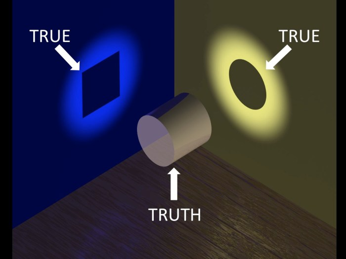
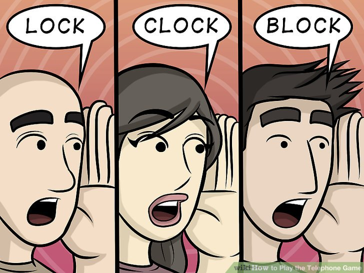

# How to design a team that would produce software of good quality?

As [Harold F. Dodge](https://asq.org/about-asq/honorary-members/dodge) said:

> You can not inspect quality into a product.

He meant that the system should be _designed_ to produce a quality product.

This article is about team design: principles of team construction that will allow the team to produce a quality product.

We know what ‘product’ is: an [information system](https://en.wikipedia.org/wiki/Information_system) allowing the client to _do something_.

The software development team _builds_ this product.

Did you take quality into account when assembling the team?

Are you aware of the team & process design aspects which influence the quality of the product your team builds?

Let’s dig in and start with the definitions.

## What is quality?

Two standards are defining the quality:

General one (for products) — [**ISO 9000**](https://efrcertification.com/Ref/ISO+9000-2005.pdf):

> **quality**
> degree to which a set of inherent characteristicts fulfil requirements

And the one talking specifically about the software quality — [**ISO 25000**](https://www.iso.org/obp/ui/#iso:std:iso-iec:25000:ed-2:v1:en):

> **software quality**
> capability of software product to satisfy stated and implied needs when used under specified conditions

Both talk about a "match" between what the client desired and what's present (produced).

We want to produce exactly what's needed or wanted, so the match is "maximised", i.e., the quality is at its highest.

A few areas of problems related to quality might occur when you create a team.

For each area, I will try to give bits of advice.

1. [Information loss in conversion](#1-information-loss-in-conversion)
2. [Quality loss due to team design](#2-quality-loss-due-to-system-design)

# 1. Information loss in conversion

The idea or desire can never be _fully_ expressed: idea-to-language transformation yields information loss. Consider it similar to digital&rarr;analogue transformation.

Then the idea (transformed to language) during the perceiving process will have even more information lost; consider this analogue&rarr;digital transformation.

The reason for the loss is simple:
- the language itself is ambiguous
- the language can only provide us with a symbolic representation of the meaning
- the symbol is perceived differently, so the meaning is not constant but temporally, contextually, and individually bound

The picture above illustrates the ambiguity of the symbolic system caused by the interpeters’ different perspectives (viewpoints).

There are two areas of science studying this particular set of problems: [Semiotics](https://en.wikipedia.org/wiki/Semiotics) and [Semantics](https://langsci-press.org/catalog/book/231)

Very simply put, "chess" can be describing "the board of chess" or "the game of chess", "green" can't be explained to a blind person, "salty" can be perceived differently not only by different people but by the same person at different times.

[Broken telephone](https://en.wikipedia.org/wiki/Chinese_whispers) experiment illustrates how the information loss is increased: the more links in the information flow chain we have, the more times the information undergoes perceiving/verbalising transformation, the more information loss we have.

Here comes the "quality team" principle #1:

## 1. The less links in the information processing chain, higher the quality.

This principle has four implications:
- teams should be sitting closer to the client
- teams should be as small as possible
- teams should be crossfunctional (no silos)
- teams members’ knowledge should overlap

### 1.1 Team should be sitting closer to the client

The client is the source of information, the closer the team sits with the client, the better the quality is: simply less information loss. Ideally, the client representative should sit right with the team.

Also, if the client representative sits with the team, the team can show the interim results more often and get more feedback.

This is very important simply because the client might not even fully understand the need, or the first way their desire is implemented might not be satisfactory for the client. The shorter the feedback cycle, the less unnecessary work is performed.

### 1.2 Team should be as small as possible

If just one engineer is helping the client to achieve what they need, the information loss is minimal — there are just two links in the chain: client -> engineer.

If the information follows the client&rarr;business analyst&rarr;architect&rarr;system analyst&rarr;engineer&rarr;QA flow, there are six links, six times the conversion is done, the information is lost significantly.

There are only two ways to overcome the inherent information loss: specify everything in more detail or reduce the number of links in the chain.

Specifying everything in more detail requires time, which is of essential value (the world changes too quickly). The whole Agile movement started with the goal of delivering clients what they wanted but faster and better.

[Studies](https://www.qsm.com/blog/2012/part-ii-small-teams-deliver-lower-cost-higher-quality) prove that the smaller the team is, the higher the quality.

One should also note that the more developers the team comprise, the higher the chance of ‘ownership blurring’ where individuals see less obvious results from their efforts.

This might result in people losing motivation or having ‘this can be done by someone else’ attitude.

Managers should ask themselves: what is the bare minimum of people required to produce what the client wants?

Is it possible to produce the software product with just 1 employee talking directly to the client (or their representative)? If not, can we get away with 2? Or 3?

### 1.3 Team should be cross-functional (no silos)

Social psychology has multiple studies on a concept called [In-group favoritism](https://en.wikipedia.org/wiki/In-group_favoritism):

> the tendency to respond more positively to people from our ingroups than we do to people from outgroups.

[Minimal group paradigm](https://en.wikipedia.org/wiki/Minimal_group_paradigm) describes:

> Experiments using this approach have revealed that even arbitrary distinctions between groups, such as preferences for certain paintings, or the color of their shirts, can trigger a tendency to favor one's own group at the expense of others, even when it means sacrificing in-group gain

Basically, people easily form groups and instantly start prejudice against the outgroup members or even discriminate against them.

As shown, the reason for the separation might be as insignificant as the colour of the shirt.

The reason for this, as [studies say](https://opentextbc.ca/socialpsychology/chapter/ingroup-favoritism-and-prejudice/), is:

> Because our ancestors lived in small social groups that were frequently in conflict with other groups, it was evolutionarily functional for them to view members of other groups as different and potentially dangerous. Differentiating between “us” and “them” probably helped keep us safe and free from disease, and as a result, the human brain became very efficient in making these distinctions

Knowing this particular social dynamic that people have in groups, it seems evident that there’s no place for separating teams based on specialisation.

That’s exactly why the concept of an interdisciplinary (or cross-functional) team was created.

The cross-functional team comprises a number of people of all specialisations required to deliver value to the client.

Do not separate team members working on a product into sub-teams based on specialisation, and you won’t get negative social dynamics of intergroup discrimination or prejudice.

### 1.4 Team members' knowledge should overlap

When your team comprises people specalising only in a very narrow field of expertise, each act of communication will require additional ‘bridging’ efforts to overcome the information loss.

Generally speaking, if your iOS developer understands backend development, their communication will be easier.

This is one of the reasons for such concepts as [T-shape](https://en.wikipedia.org/wiki/T-shaped_skills), [Devops](https://en.wikipedia.org/wiki/DevOps) and [TestOps](https://en.wikipedia.org/wiki/TestOps) emerged.

To summarise the outcomes of the ‘less links’ principle:

- get a client (or their representative) right in the team
- figure out what minimal amount of people with what specialisations your team needs
- don’t separate specialists into sub-teams, have them focused on delivering what the client needs
- make sure their knowledge overlaps

This will reduce the information loss and therefore reduce [‘waste’](https://dl.acm.org/doi/abs/10.1109/ICSE.2017.20):

> Waste is any activity that produces no value for the customer or user.
This depends on the product you’re building.

Practical advice on how to achieve that is [here](team_knowledge.md).

# 2. Quality loss due to system design

In the [first chapter](#1-information-loss-in-conversion), I focused on team topology aspects that affect the information flow in principle.

Here I will focus on the aspects of team design that influence people's behaviour (or motivation).

I’m sure you must have seen ‘tired and unhappy’ receptionists at some hotel, try to recall: were they keen on satisfying your needs?

Why were they behaving this way? The information could flow perfectly well; nothing was technically stopping it; they could get all the required details from you, the client.

They might have had all the skills required to do the job.

Merriam-Webster [defines skill](https://www.merriam-webster.com/dictionary/skill) as:

> the ability to use one's knowledge effectively and readily in execution or performance

So, granted, we created a good team topology and hired skillful employees; what is the next prerequisite for the successful information flow?

It's tempting to say that the receptionist in our example simply lacked motivation (or desire) to set the information flowing and get all the details from us.

But things are much more complicated. Along with the information flow, motivation depends severely on the system design too.

The main concept here is 'unhappiness'. When your employee is not 'happy', they won't even want to make the client happy; they won't even _want_ to try to understand the client.

Happiness is a very broad concept, but surely work influences employee’s happiness.

Many studies ( [1](https://quod.lib.umich.edu/b/busadwp/images/b/2/0/b2014142.0001.001.pdf), [2](https://www.tandfonline.com/doi/abs/10.1080/10686967.1996.11918726) ) show how strongly productivity and quality are related.

There’s also a great [overview study](https://www.researchgate.net/publication/332494069_Happiness_and_the_productivity_of_software_engineers) from Daniel Graziotin (Universität Stuttgart) and Fabian Fagerholm at Aalto University. The study tries to answer the big question — are happy employees more productive? And the answer is: **yes, they are more productive when happy**.

So it seems pretty reasonable to postulate that unhappy engineers yield worse results in quantity and quality.

Let’s see what the study shows as reasons for engineers’ unhappiness.

## 1. There should be no time pressure

> Being stuck in problem-solving and time pressure are the two most frequent causes of unhappiness
> ...
> developers feel bad when they are stuck and under pressure, and several detrimental consequences do happen

Engineers are pressed for time when the software development process employs concepts like estimates, deadlines, and sprints.

Very rarely, there’s a rational reason to have deadlines in software development, and even more, estimations at all. I suggest you watch [my talk](https://www.youtube.com/watch?v=tqoJOEjeAEw) on the topic.

There’s also a good book [#NoEstimates](http://noestimatesbook.com) which explains how to meet goals without imposing time pressure on the developers.

**Advice**: consider running the development process without the following concepts: estimations, story points, deadlines, sprints (or any other practice imposing time pressure on engineers).

## 2. Professional ethics should not be broken

> The third most frequent cause of unhappiness is to work with bad code and, more specifically, with bad code practices. Developers are unhappy when they produce bad code, but they suffer tremendously when they meet bad code that could have been avoided in the first place. As our participants stated, bad code can be a result of management decisions aiming to save time and effort in the short term.

Martin Fowler has an excellent [article](https://martinfowler.com/articles/is-quality-worth-cost.html) explaining how ‘cutting costs’ on tests makes development more expensive.

This obligation to do the work _properly_ is called professional ethics.

When a patient has surgery, no one can demand a surgeon to finish the operation sooner. Everyone respects the surgeon’s work. Surgeons’ professional ethics rely solely on the surgeon’s professional judgment of how the procedure is to be done for the best of the patient.

In software development, it’s the team's professional judgment that is to be used to determine how the code should be written.

The advice here is simple: don't break the team's professional ethics by telling them to skip something to achieve short-term savings. As Fowler says, you'll lose more in the long term. **And** the team happiness will decrease too.

## 3. Process activities should not toggle inadequacy of self

> Similar negative effects were mentioned regarding third persons (such as colleagues, team leaders, or customers) who make developers feel inadequate with their work, forced repetitive mundane tasks, and imposed limitations on development

Some examples of activities that might toggle the feeling of inadequacy of self:
- testing after development
- code review

### 3.1 Testing shouldn’t be done only after the development

Testing after development (i.e. [quality control](https://www.techtarget.com/whatis/definition/quality-control-QC)) is verification process if the delivered software matches the requirement. The process is not that bad, but it shouldn’t be used exclusively.

If it’s used exclusively, there are two bad outcomes:
- if the quality is not good, a significant rework is required, and this has a detrimental effect on the team's happiness (and is a huge waste of resources, too) — no one will be happy when the result of their work is thrown away
- a person who performed the QC procedure might be perceived as someone diminishing the effort the engineer spends on producing the software

[Shift left testing](https://insights.sei.cmu.edu/blog/four-types-of-shift-left-testing/) approach appears to solve these issues. Read it, employ it.

### 3.2 Code reviews should potentially go away

Like the previous factor, checking at the ‘done’ stage is too late and ineffective.

Here’s [an article to read](https://hackernoon.com/code-review-its-bad-expensive-and-ineffective-in-most-cases).

Quote:

> Every human being associates her work results with themselves.
> Valuing things we spend effort on doing is innate to our nature.
>
> Whenever a developer receives feedback like “this has to be redone”, they will inevitably associate this feedback with themselves.
>
> The more effort a person spent on doing something, the more vulnerable she is to the critics. And while she hadn’t been taught properly how the problem should have been solved, she considers negative feedback even worse.
>
> Internet’s full of posts and articles on how to “solve” this “negativity problem”. Most of these posts talk about how to provide more “positive” feedback.
>
> Microsoft even hired a fully dedicated specialist working on this issue.
>
> However, this all seems palliative treatment, none of these approaches offer to solve the problem properly.
>
> Solving the problem properly would be introducing the teaching or planning phase before the effort on doing the task is spent and a feeling of achievement emerges.

**Advice**: think about what behaviors your process activities encourage in developers. Are they encouraged to collaborate (as in pair/ensemble programming or shift-left testing), or are they inspired to frown upon the results of each other work (as in code review or testing after production)?

Employ pair programming, or at least move away from code reviews when you see that there are no more significant issues found during the code reviews.

## 4. Boredom should be avoided

> Similar negative effects were mentioned regarding third persons (such as colleagues, team leaders, or customers) who make developers feel inadequate with their work, **forced repetitive mundane tasks**, and imposed limitations on development

The key points here are: _repetitive_ and _mundane_.

Software development (as pretty much any other type of intellectual labour) is all about solving problems. World changes often, new problems arise all the time, and there’s pretty much always something new to solve.

Yet, sometimes engineers do need to do something ‘not new’, something they know for sure how to do.

The problem which toggles unhappiness is when the amount of repetitive tasks is getting high.

Some examples:
- manual verification of code quality (testing)
- writing boilerplate code
- solving the same task over and over again (after code review rejection, for example)

**Advice**:
- check the amount of rework (waste), think about minimising it (possibly get rid of code review in favour of pair/ensemble programming or at least pair/ensemble technical design)
- consider having repetitive work automated (shifting from manual regression testing to automated testing or even TDD)

Another fundamental concept here is ‘mundane’ work. Mundane generally implies a lack of interest. But what is this lack of interest? How does interest emerge in developers?

If there’s no understanding of why the work is needed and what value it brings to the team or the client, ‘interest’ will unlikely emerge.

So it seems to be very important to have full transparency on why the work that’s requested is important and what value it brings.

To summarise the advice here:
- Don’t impose non-rational time pressure on your employees; use either a statistical approach to estimations or no estimations; prioritise projected value, not cost.
- Don’t break the professional ethics: you hired professionals to do their job; intruding the process to cut the costs negatively impacts the [total cost of ownership](https://en.wikipedia.org/wiki/Total_cost_of_ownership) of the system and the team motivation.
- Design the process to minimise waste: employ pair programming, TDD, shift-left testing.
- Make sure employees fully understand a clear vision of the purpose of work.

-----

**References**:

- [Analyzing meaning: An introduction to semantics and pragmatics.](https://langsci-press.org/catalog/book/231)
- [Tricky linguistics from A Bit of Fry & Laurie](https://www.youtube.com/watch?v=v2cmjbgfbJc)
- [Modern Software Development](https://www.amazon.co.uk/gp/product/B09GG6XKS4/)
- [Test Driven Development](https://www.amazon.co.uk/gp/product/0321503627/)
- [In-group favouritism and out-group discrimination in naturally occurring groups](https://journals.plos.org/plosone/article?id=10.1371/journal.pone.0221616)
- [Social Categorization and the Formation of Intergroup Attitudes in Children](https://www.jstor.org/stable/1131676)
- [Ingroup Favoritism and Prejudice](https://opentextbc.ca/socialpsychology/chapter/ingroup-favoritism-and-prejudice/)
- [Experiments in Intergroup Discrimination](https://www.jstor.org/stable/24927662)
- [The Honda effect revisited](http://castletonconsulting.co.uk/wp-content/uploads/2013/07/The_Honda_effect_revisited.pdf)
- [The influence of organisational structure on software quality: an empirical case study](https://www.microsoft.com/en-us/research/wp-content/uploads/2016/02/tr-2008-11.pdf)
- [Dave Farley on TDD & quality](https://www.youtube.com/watch?v=ln4WnxX-wrw)
- [Four types of Shift Left testing](https://insights.sei.cmu.edu/blog/four-types-of-shift-left-testing/)
- [How do personality, team processes and task characteristics relate to job satisfaction and software quality?](https://www.sciencedirect.com/science/article/abs/pii/S0950584908001080)
- [An Empirical Investigation of the Relationship between Quality and Productivity](https://www.tandfonline.com/doi/abs/10.1080/10686967.1996.11918726)
- [An empirical analysis of productivity and quality in software products](https://quod.lib.umich.edu/b/busadwp/images/b/2/0/b2014142.0001.001.pdf)
