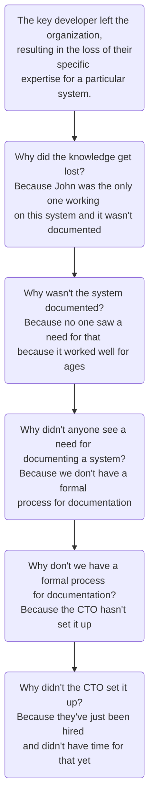

```mermaid
flowchart TD
    A(The key developer left the organization,\n resulting in the loss of their specific \nexpertise for a particular system.) 
      --> B(Why did the knowledge get lost?\nBecause John was the only one working \non this system and it wasn't documented)
    B --> C(Why wasn't the system documented?\nBecause no one saw a need for that \nbecause it worked well for ages)
    C --> D(Why didn't anyone see a need for \ndocumenting a system?\nBecause we don't have a formal \nprocess for documentation)
    D --> E(Why don't we have a formal process \nfor documentation?\nBecause the CTO hasn't set it up)
    E --> F(Why didn't the CTO set it up?\nBecause they've just been hired \nand didn't have time for that yet)
```
