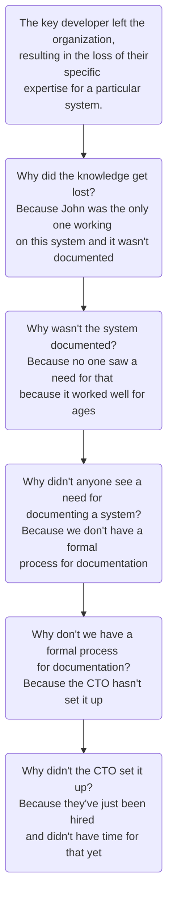
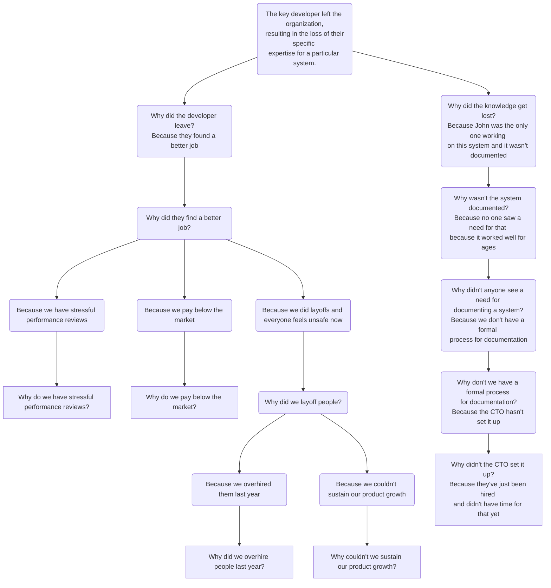

simple diagram, just the 5 whys:

```mermaid
flowchart TD
    A(The key developer left the organization,\n resulting in the loss of their specific \nexpertise for a particular system.) 
      --> B(Why did the knowledge get lost?\nBecause John was the only one working \non this system and it wasn't documented)
    B --> C(Why wasn't the system documented?\nBecause no one saw a need for that \nbecause it worked well for ages)
    C --> D(Why didn't anyone see a need for \ndocumenting a system?\nBecause we don't have a formal \nprocess for documentation)
    D --> E(Why don't we have a formal process \nfor documentation?\nBecause the CTO hasn't set it up)
    E --> F(Why didn't the CTO set it up?\nBecause they've just been hired \nand didn't have time for that yet)
```

more complex diagram, not only the 5 whys:

```mermaid
flowchart TD
    A --> G(Why did the developer leave?\nBecause they found a better job)
    G --> H(Why did they find a better job?)
    H --> J(Because we pay below the market)
    H --> K(Because we did layoffs and everyone feels unsafe now)
    H --> L(Because we have stressful performance reviews)
    L --> N[Why do we have stressful performance reviews?]
    J --> M[Why do we pay below the market?]
    K --> O(Why did we layoff people?)
    O --> P(Because we overhired them last year )
    O --> R(Because we couldn't sustain our product growth)
    P --> Q[Why did we overhire people last year?]
    R --> S[Why couldn't we sustain our product growth?]

    

    A(The key developer left the organization,\n resulting in the loss of their specific \nexpertise for a particular system.) 
      --> B(Why did the knowledge get lost?\nBecause John was the only one working \non this system and it wasn't documented)
    B --> C(Why wasn't the system documented?\nBecause no one saw a need for that \nbecause it worked well for ages)
    C --> D(Why didn't anyone see a need for \ndocumenting a system?\nBecause we don't have a formal \nprocess for documentation)
    D --> E(Why don't we have a formal process \nfor documentation?\nBecause the CTO hasn't set it up)
    E --> F[Why didn't the CTO set it up?\nBecause they've just been hired \nand didn't have time for that yet]


```
